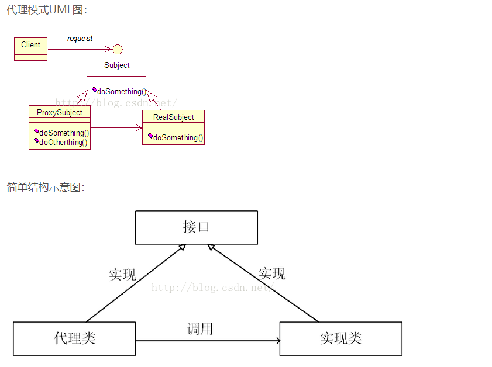

# 代理设计模式

举个租房子的场景：

> 租房子的时候，出租方是房东，但是对于一个租客来说，他有可能不认识房东，因此就不好租到房子；但是我们可以从中介那里租房子，按时交租即可，我们交的租金有一部分被中介赚去，房东要求的租金有可能被中介改成一个较高的值(比如房东说一月3000，中介说一月5000等)，但是没有房东，中介没有办法出租了

上面的例子中，房东就是真实提供服务的对象，中介就是代理对象，代理对象是依赖真实提供服务的对象提供服务的。

我们交租金给房东，可以理解为一个方法，我们交的钱就是方法的参数，但是实际到房东那里的钱，没有我们交出去的多，中介赚差价，这就是代理可以拦截请求的参数；

房东发出租金要求，但是中介改成一个较高的值，这就是代理可以拦截方法的返回值；

其实对于租客来说，他只是想租房子(核心需求)，不想为了租房子而东奔西跑；对于房东来说，他只是想租出去房子，中介省去了二者东奔西跑，相互联系的麻烦，是代理让需求更精准，让价值更聚焦，这就是代理模式的好处。

代理模式就是让代理对象，控制对提供服务对象的访问，负责预处理(过滤，转发等)发送给服务对象的消息，对服务对象产生的结果进行后续的处理的思想。



# JDK动态代理

JDK动态代理是基于接口的，意思是我们把需要代理的功能抽象成接口，然后JDK动态代理就可以生成实现了这些接口的代理对象。

首先认识几个类：

1. `java.lang.reflect.Proxy`，他的构造方法一个是私有的，一个是保护的；有两个方法
   - static Class getProxyClass (ClassLoaderloader, Class[] interfaces)：获得一个代理类，其中loader是类装载器，interfaces是真实类所拥有的全部接口的数组。
   - static Object newProxyInstance(ClassLoaderloader, Class[] interfaces, InvocationHandler h)：返回代理类的一个实例，返回后的对象实现了interfaces接口的实例
2. InvocationHandler 
   - object invoke(Object obj,Method method, Object[] args)，只有这么一个方法，obj就是代理对象method，方法对象，方法参数

InvocationHandler 就是最终实现功能的接口，因为代理实现功能最终还是依赖于服务对象，因此在其invoke方法里，调用服务对象的方法即可。

使用步骤：

1. 首先把功能抽象成接口：

```java
package com.victory.test.proxy;

public interface SayHelloFunction {
    //简单起见，我需要实现一个打印hello的功能
    void sayHello();
}
```

2. 实现InvocationHandler:

```java
package com.victory.test.proxy;

import java.lang.reflect.InvocationHandler;
import java.lang.reflect.Method;

public class InvocationHandlerTestImpl implements InvocationHandler {

    private SayHelloFunction sayHelloFunction;

    InvocationHandlerTestImpl(SayHelloFunction sayHelloFunction){
        this.sayHelloFunction = sayHelloFunction;
    }

    public Object invoke(Object proxy, Method method, Object[] args) throws Throwable {
        if(sayHelloFunction==proxy){
            System.out.println("new 的对象和代理对象一样");
        }else {
            System.out.println("new 的对象和代理对象不一样");
        }
        //可以在这里做对参数的修改，返回值的修改等
        System.out.println("proxy type:"+proxy.getClass().getName());
        System.out.println("method name:"+method.getName());
        Object res = method.invoke(this.sayHelloFunction,args);
        System.out.println("method result:"+res);
        return res;
    }

}
```

3. 因为代理实现功能最终还是依赖于服务对象，我们需要把服务对象注入进来，服务对象实现了sayHelloFunction功能：

```java
public class SayHelloFunctionImpl implements SayHelloFunction{
    public void sayHello() {
        System.out.println("hello");
    }
}
```

4. 测试：

```java
package com.victory.test.proxy;

import java.lang.reflect.InvocationHandler;
import java.lang.reflect.Proxy;

public class ProxyTest {

    public static void main(String[] args) {
        //实例化服务对象
        SayHelloFunction sayHelloFunction = new SayHelloFunctionImpl();
        //实例化InvocationHandler
        InvocationHandler handler = new InvocationHandlerTestImpl(sayHelloFunction);
        ClassLoader loader = sayHelloFunction.getClass().getClassLoader();
        Class[] interfaces = sayHelloFunction.getClass().getInterfaces();
        //获取代理对象
        ProxyTestInterface sayHelloFunction1 = (ProxyTestInterface) Proxy.newProxyInstance(loader,interfaces,handler);
        System.out.println("代理对象调用sayHello");
        sayHelloFunction1.sayHello();
        System.out.println("真实的实现类对象调用sayHello");
        proxyTestInterface.sayHello();
    }
}
```

结果：

```text
代理对象调用sayHello
new 的对象和代理对象不一样
proxy type:com.sun.proxy.$Proxy0
method name:sayHello
hello
method result:null
真实的实现类对象调用sayHello
hello
```

# 3 JDK动态代理实现原理

Java中的类中登记了类的各种属性，e.g.构造方法，静态/实例变量，静态/实例方法，静态/实例块等，描述类的对象就是Class对象，一个类型的Class对象在一个JVM实例中是唯一的，类中记录的都是公共信息。因此，只要有Class对象，就可以创建相关类的对象，调用其方法。这是实现动态代理的基础。

简单来说，JDK实现动态代理的原理就是，动态的生成class字节码文件，然后装载，创建对象，然后执行。

生成的这个类是`java.lang.reflect.Proxy`的子类(我们可以在InvocationHandler的invoke方法中，打印代理对象的父类信息：`System.out.println("super proxy type:"+proxy.getClass().getSuperclass().getName());`)

> `java.lang.reflect.Proxy`这个类有一个特点，里面存在一个InvocationHandler的引用，
>
> ```java
> /**
> * A method invocation on a proxy instance through one of its proxy
> * interfaces will be dispatched to the {@link InvocationHandler#invoke
> * invoke} method of the instance's invocation handler, passing the proxy
> * instance, a {@code java.lang.reflect.Method} object identifying
> * the method that was invoked, and an array of type {@code Object}
> * containing the arguments. 
> */
> ```
>
> 并且在Proxy实例上，一个通过接口调用的方法，将会被派发到InvocationHandler的invole方法上。

[关于Java的数组](https://www.cnblogs.com/syxy/p/12347062.html)

[关于数组的clone方法](https://segmentfault.com/q/1010000007236444)

源码分析：

1. `Proxy.newProxyInstance`

   ```java
       @CallerSensitive
       public static Object newProxyInstance(ClassLoader loader,
                                             Class<?>[] interfaces,
                                             InvocationHandler h)
           throws IllegalArgumentException
       {
           Objects.requireNonNull(h);
   
           final Class<?>[] intfs = interfaces.clone();
           final SecurityManager sm = System.getSecurityManager();
           if (sm != null) {
               checkProxyAccess(Reflection.getCallerClass(), loader, intfs);
           }
   
           /*
            * 1.根据要实现的接口和类加载器，获取代理类的Class对象
            */
           Class<?> cl = getProxyClass0(loader, intfs);
   
           try {
               if (sm != null) {
                   checkNewProxyPermission(Reflection.getCallerClass(), cl);
               }
   
            /* 2.
            * 获取其构造方法 参数是constructorParams，这个是个常量
            * private static final Class<?>[] constructorParams ={ InvocationHandler.class };
            * 说明代理Class对象有一个构造方法需要传递一个InvocationHandler对象
            */
               final Constructor<?> cons = cl.getConstructor(constructorParams);
               final InvocationHandler ih = h;
               if (!Modifier.isPublic(cl.getModifiers())) {
                   AccessController.doPrivileged(new PrivilegedAction<Void>() {
                       public Void run() {
                           cons.setAccessible(true);
                           return null;
                       }
                   });
               }
               /**
               * 3. 创建对象返回
               */
               return cons.newInstance(new Object[]{h});
           } catch (IllegalAccessException|InstantiationException e) {
               throw new InternalError(e.toString(), e);
           } catch (InvocationTargetException e) {
               Throwable t = e.getCause();
               if (t instanceof RuntimeException) {
                   throw (RuntimeException) t;
               } else {
                   throw new InternalError(t.toString(), t);
               }
           } catch (NoSuchMethodException e) {
               throw new InternalError(e.toString(), e);
           }
       }
   ```

   上面的核心的代码都标识出来了，分别是获取代理Class，获取构造器，创建对象，获取构造器，创建对象都是调用反射的内容，没什么好说的，我们看一下获取代理Class的过程。

2. ` getProxyClass0`

   ```java
       /**
        * Generate a proxy class.  Must call the checkProxyAccess method
        * to perform permission checks before calling this.
        * 翻译：创建一个代理类，在调用之前必须调用checkProxyAccess去执行权限检查
        */
       private static Class<?> getProxyClass0(ClassLoader loader,
                                              Class<?>... interfaces) {
           if (interfaces.length > 65535) {
               throw new IllegalArgumentException("interface limit exceeded");
           }
   
           // If the proxy class defined by the given loader implementing
           // the given interfaces exists, this will simply return the cached copy;
           // otherwise, it will create the proxy class via the ProxyClassFactory
           
           /**
           * 这里有缓存操作，如果代理Class已经存在，就返回；否则就通过ProxyClassFactory 创建一个
           */
           return proxyClassCache.get(loader, interfaces);
       }
   ```

   proxyClassCache的声明是WeakCache类型的引用：

   ```java
   private static final WeakCache<ClassLoader, Class<?>[], Class<?>>
       proxyClassCache = new WeakCache<>(new KeyFactory(), new ProxyClassFactory());
   ```

   这个WeakCache具体是啥这里不做具体的分析，可以肯定的是，它是一种映射数据结构(类似于Map，其实内部也是用Map实现的)，更够根据传入的loader, interfaces参数，获取到一个Class对象，摘自JDK文档的描述：

   > ```java
   > /*
   > * Cache mapping pairs of {@code (key, sub-key) -> value}. Keys and values are
   > * weakly but sub-keys are strongly referenced. 
   > */
   > ```

3. `proxyClassCache.get(loader, interfaces);`

   ```java
       public V get(K key, P parameter) {
           Objects.requireNonNull(parameter);
   
           expungeStaleEntries();
   
           Object cacheKey = CacheKey.valueOf(key, refQueue);       
           /*
           * map 的声明： private final ConcurrentMap<Object, ConcurrentMap<Object, Supplier<V>>> map
           = new ConcurrentHashMap<>(); 是个Map
           */
           ConcurrentMap<Object, Supplier<V>> valuesMap = map.get(cacheKey);
           if (valuesMap == null) {
               ConcurrentMap<Object, Supplier<V>> oldValuesMap
                   = map.putIfAbsent(cacheKey,
                                     valuesMap = new ConcurrentHashMap<>());
               if (oldValuesMap != null) {
                   valuesMap = oldValuesMap;
               }
           }
   
           // 根据new WeakCache<>(new KeyFactory(), new ProxyClassFactory()); 知道，subKeyFactory就是new KeyFactory()
           Object subKey = Objects.requireNonNull(subKeyFactory.apply(key, parameter));
           Supplier<V> supplier = valuesMap.get(subKey);
           Factory factory = null;
   
           while (true) {
               if (supplier != null) {
                   //重点代码
                   V value = supplier.get();
                   if (value != null) {
                       return value;
                   }
               }
   			//......
           }
       }
   ```

   最终返回的是supplier.get(); 从下面的代码可以知道，supplier其实是被赋值为factory，而factory是WeakCache内部的一个类，实现了Supplier接口

   ```java
   private final class Factory implements Supplier<V> {
   
       private final K key;
       private final P parameter;
       private final Object subKey;
       private final ConcurrentMap<Object, Supplier<V>> valuesMap;
   
       Factory(K key, P parameter, Object subKey,
               ConcurrentMap<Object, Supplier<V>> valuesMap) {
           this.key = key;
           this.parameter = parameter;
           this.subKey = subKey;
           this.valuesMap = valuesMap;
       }
   
       @Override
       public synchronized V get() { 
           Supplier<V> supplier = valuesMap.get(subKey);
           if (supplier != this) {
               return null;
           }
           V value = null;
           try {
               //重点是这行代码，调用了valueFactory的apply方法，valueFactory是Proxy通过构造方法传递过来的new ProxyClassFactory()
               value = Objects.requireNonNull(valueFactory.apply(key, parameter));
           } finally {
               if (value == null) { 
                   valuesMap.remove(subKey, this);
               }
           }
      		//......
           return value;
       }
   }
   ```

4. ProxyClassFactory的apply方法

   ```java
   @Override
           public Class<?> apply(ClassLoader loader, Class<?>[] interfaces) {
   
               Map<Class<?>, Boolean> interfaceSet = new IdentityHashMap<>(interfaces.length);
               
               /**
               * 这里主要是校验接口的合法性，例如不能重复等
               */
               for (Class<?> intf : interfaces) {
                 
                   Class<?> interfaceClass = null;
                   try {
                       interfaceClass = Class.forName(intf.getName(), false, loader);
                   } catch (ClassNotFoundException e) {
                   }
                   if (interfaceClass != intf) {
                       throw new IllegalArgumentException(
                           intf + " is not visible from class loader");
                   }
                   /*
                    * Verify that the Class object actually represents an
                    * interface.
                    */
                   if (!interfaceClass.isInterface()) {
                       throw new IllegalArgumentException(
                           interfaceClass.getName() + " is not an interface");
                   }
                   /*
                    * Verify that this interface is not a duplicate.
                    */
                   if (interfaceSet.put(interfaceClass, Boolean.TRUE) != null) {
                       throw new IllegalArgumentException(
                           "repeated interface: " + interfaceClass.getName());
                   }
               }
   
               String proxyPkg = null;     //代理类的包名
               int accessFlags = Modifier.PUBLIC | Modifier.FINAL;
   
               /*
                * Record the package of a non-public proxy interface so that the
                * proxy class will be defined in the same package.  Verify that
                * all non-public proxy interfaces are in the same package.
                * 翻译：记录一个非公有的代理接口的包名，以至于代理类可以被定义在相同的包下，
                * 校验所有的非公有的代理接口都定义在相同的包下
                */
               for (Class<?> intf : interfaces) {
                   int flags = intf.getModifiers();
                   if (!Modifier.isPublic(flags)) {
                       accessFlags = Modifier.FINAL;
                       String name = intf.getName();
                       int n = name.lastIndexOf('.');
                       String pkg = ((n == -1) ? "" : name.substring(0, n + 1));
                       if (proxyPkg == null) {
                           proxyPkg = pkg;
                       } else if (!pkg.equals(proxyPkg)) {
                           throw new IllegalArgumentException(
                               "non-public interfaces from different packages");
                       }
                   }
               }
   
               if (proxyPkg == null) {
                   // if no non-public proxy interfaces, use com.sun.proxy package
                   proxyPkg = ReflectUtil.PROXY_PACKAGE + ".";
               }
   
               /*
                * Choose a name for the proxy class to generate.
                * proxyClassNamePrefix的值是常量$Proxy，所以最终的名称com.sun.proxy.$Proxy{num}
                */
               long num = nextUniqueNumber.getAndIncrement();
               String proxyName = proxyPkg + proxyClassNamePrefix + num;
   
               /*
                * 生成字节码
                */
               byte[] proxyClassFile = ProxyGenerator.generateProxyClass(
                   proxyName, interfaces, accessFlags);
               try {
                   return defineClass0(loader, proxyName,
                                       proxyClassFile, 0, proxyClassFile.length);
               } catch (ClassFormatError e) {
                   /*
                    * A ClassFormatError here means that (barring bugs in the
                    * proxy class generation code) there was some other
                    * invalid aspect of the arguments supplied to the proxy
                    * class creation (such as virtual machine limitations
                    * exceeded).
                    */
                   throw new IllegalArgumentException(e.toString());
               }
           }
   ```

   ProxyGenerator.generateProxyClass(a,b,c)是生成字节码的方法，到这里我们已经知道了，JDK内部是构造了一个字节码流，然后加载生产Class对象

   手动调用这个方法，生成一个class看一下；

5. `ProxyGenerator.generateProxyClass`

   ```java
       private static void generateProxyClass() {
           ProxyTestInterface proxyTestInterface = new ProxyTestInterfaceImpl();
           String name = "com.victory.test.ProxyTestInterfaceInstance";
           byte[] data = ProxyGenerator.generateProxyClass(name,proxyTestInterface.getClass().getInterfaces());
           FileOutputStream out =null;
           try {
               out = new FileOutputStream("ProxyTestInterfaceInstance.class");
               out.write(data);
           } catch (FileNotFoundException e) {
               e.printStackTrace();
           } catch (IOException e) {
               e.printStackTrace();
           }finally {
               if(null!=out) try {
                   out.close();
               } catch (IOException e) {
                   e.printStackTrace();
               }
           }
   
       }
   ```

   把生成的class放在IDEA反编译：

   ```java
   package com.victory.test;
   
   import com.victory.test.proxy.ProxyTestInterface;
   import java.lang.reflect.InvocationHandler;
   import java.lang.reflect.Method;
   import java.lang.reflect.Proxy;
   import java.lang.reflect.UndeclaredThrowableException;
   
   public final class ProxyTestInterfaceInstance extends Proxy implements ProxyTestInterface {
       private static Method m1;
       private static Method m3;
       private static Method m2;
       private static Method m0;
   
       public ProxyTestInterfaceInstance(InvocationHandler var1) throws  {
           super(var1);
       }
   
       public final boolean equals(Object var1) throws  {
           try {
               return (Boolean)super.h.invoke(this, m1, new Object[]{var1});
           } catch (RuntimeException | Error var3) {
               throw var3;
           } catch (Throwable var4) {
               throw new UndeclaredThrowableException(var4);
           }
       }
   
       public final void sayHello() throws  {
           try {
               super.h.invoke(this, m3, (Object[])null);
           } catch (RuntimeException | Error var2) {
               throw var2;
           } catch (Throwable var3) {
               throw new UndeclaredThrowableException(var3);
           }
       }
   
       public final String toString() throws  {
           try {
               return (String)super.h.invoke(this, m2, (Object[])null);
           } catch (RuntimeException | Error var2) {
               throw var2;
           } catch (Throwable var3) {
               throw new UndeclaredThrowableException(var3);
           }
       }
   
       public final int hashCode() throws  {
           try {
               return (Integer)super.h.invoke(this, m0, (Object[])null);
           } catch (RuntimeException | Error var2) {
               throw var2;
           } catch (Throwable var3) {
               throw new UndeclaredThrowableException(var3);
           }
       }
   
       static {
           try {
               m1 = Class.forName("java.lang.Object").getMethod("equals", Class.forName("java.lang.Object"));
               m3 = Class.forName("com.victory.test.proxy.ProxyTestInterface").getMethod("sayHello");
               m2 = Class.forName("java.lang.Object").getMethod("toString");
               m0 = Class.forName("java.lang.Object").getMethod("hashCode");
           } catch (NoSuchMethodException var2) {
               throw new NoSuchMethodError(var2.getMessage());
           } catch (ClassNotFoundException var3) {
               throw new NoClassDefFoundError(var3.getMessage());
           }
       }
   }
   
   ```

   可以看到通过这个方法生成的class，继承Proxy，实现了指定的接口。实现方式，就是把当前的实例this，相关的方法对象，和相关的参数，传递给其内部的InvocationHandler实例

