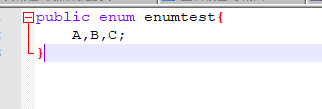
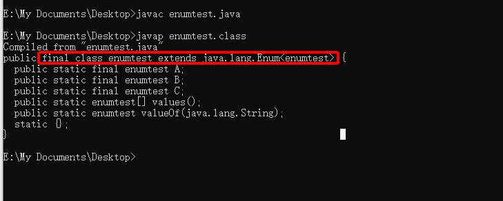
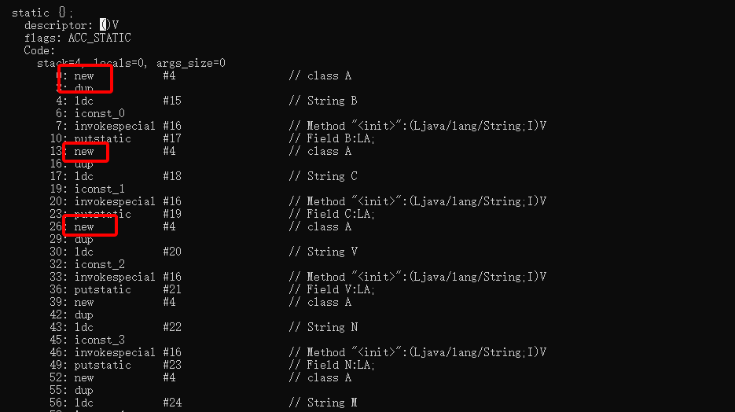
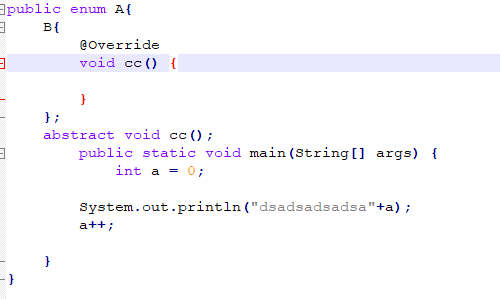
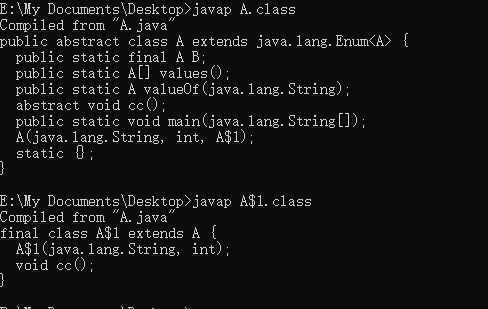

1. 枚举是一个类，是编译器的一个语法糖，JDK1.5的新特性

   简单验证：

   1. 写一个简单的枚举：

      

   2. 编译+反编译

      

      可以看出枚举已经继承Enum类，所以枚举不能继承其他类，但是可以实现接口

      enumtest还是final修饰的，因此不能被继承 ，每一个枚举值都是一个公开，静态，最终修饰的enumtest的对象 

   3. 枚举可以定义构造函数，实例变量和方法，静态变量和方法，静态块和实例块以及抽象方法，这些东西只能定义在枚举常量之后，否则编译器报错

   4. 枚举类的方法

      - name()，继承自Enum抽象类的实例方法，返回枚举的名称，一般跟枚举常量的名称一样的

      - values()，编译器生成的静态方法，返回所有的枚举常量数组

      - valueOf(String name) 编译器生成的静态方法，根据一个字符串返回一个枚举常量，字符串需要跟枚举常量名称一致，否则抛出异常

      - getDeclaringClass() 继承自Enum抽象类的实例方法，获取枚举类的Class对象

      - ordinal() 继承自Enum抽象类的实例方法，返回枚举常量的声明序号，从0开始，Enum类的compareTo方法是通过比较序号完成的

      - Enum类的构造方法 Enum类内部会有一个构造函数，编译器在编译使用enum关键字定义的枚举时，会在静态块中，插入创建对象的JVM指令

        

      - Enum类中只有toString方法是可以被覆盖的，其他的方法要么是private修饰，要么是final修饰

      - 当枚举定义抽象方法时，编译器会把枚举定义成一个抽象类，并要求枚举常量实现这个抽象方法，然后在生成一个类，继承原来的枚举类；

        

        

        

      - 枚举的实例不可以作为函数形参

   5. 相关文章:https://www.cnblogs.com/alter888/p/9163612.html

   6. 