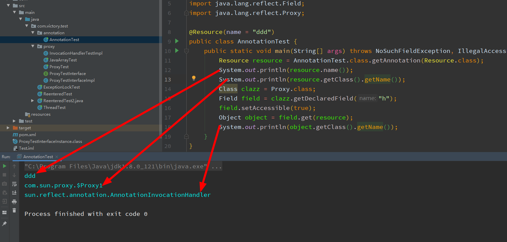

# 1 注解的使用

1. 注解是JDK1.5的新特性，所有的注解直接父接口都是`java.lang.annotation.Annotation`

2. 作用

   - 生成文档。这是最常见的，也是java 最早提供的注解。常用的有@see @param @return 等；
   - 替代配置文件。比较常见的是spring 2.5 开始的基于注解配置。作用就是减少配置。现在的框架基本都使用了这种配置来减少配置文件的数量
   - 编译时进行格式检查。如@Override放在方法前，如果你这个方法并不是覆盖了超类方法，则编译时就能检查出；
   - 实现代码复用，增强可维护性

3. 元注解(JDK1.5)

   - @Target 表示注解标记的范围，其参数是`ElementType`类型的数组：
     - 　　CONSTRUCTOR:用于描述构造器
     - 　　FIELD:用于描述域即类成员变量
     - 　　LOCAL_VARIABLE:用于描述局部变量
     - 　　METHOD:用于描述方法
     - 　　PACKAGE:用于描述包
     - 　　PARAMETER:用于描述参数
     - 　　TYPE:用于描述类、接口(包括注解类型) 或enum声明
     - 　　TYPE_PARAMETER:1.8版本开始，描述类、接口或enum参数的声明
     - 　　TYPE_USE:1.8版本开始，描述一种类、接口或enum的使用声明
   - @Retention，用于描述注解的生命周期，表示需要在什么级别保存该注解，即保留的时间长短。取值类型（RetentionPolicy）有以下几种：
     - 　　SOURCE:在源文件中有效（即源文件保留）
     - 　　CLASS:在class文件中有效（即class保留）
     - 　　RUNTIME:在运行时有效（即运行时保留）
   - @Documented，　用于描述其它类型的annotation应该被作为被标注的程序成员的公共API，因此可以被例如javadoc此类的工具文档化。它是一个标记注解，没有成员。
   - @Inherited，用于表示某个注解的作用是可以被继承的。如果一个使用了@Inherited修饰的annotation类型被用于一个class，则这个annotation将被用于该class的子类，但是互相继承的接口，或者类实现接口时，注解的作用都不会被继承

4. 定义一个注解的格式：

   访问修饰符 @interface 注解名称{

   ​	数据类型 方法名称() [default 默认值];

   }，

   @interface 是编译器的语法糖，会被解析为一个继承于`java.lang.annotation.Annotation`的接口

   注解的数据类型只有以下几种：

   - 八种原始类型
   - String
   - Class
   - 枚举类型
   - 注解类型
   - 以上的数组

5. 注解处理

   使用反射可以获取所有被指定注解标记的java语言元素(类，方法，字段，参数等)，然后做自定义的处理

# 2 注解的原理

注解实质上是一个接口，接口是不可以被实例化的，那么注解的方法是怎样被调用的呢？答案是：对于被`@Retention(RetentionPolicy.RUNTIME)`标记的注解，JVM会使用动态代理生成一个代理类实现注解的接口，我们通过反射获取到的注解实例，就是动态代理，我们通过代理就可以调用注解的方法，拿到返回值。

验证：



可以看到，获取到的注解的实例是`com.sun.$Proxy1`，这正是动态代理对象对应的Class对象，为了进一步验证是动态代理，我们知道java的动态代理对象，是继承于`java.lang.reflect.Proxy`的一个子类对象，Proxy中有一个InvocationHandler的接口引用，通过这个对象（resource）自然可以获取到，InvocationHandler的引用，可以看到，实现注解方法的InvocationHandler的实现类对象是`sun.reflect.annotation.AnnotationInvocationHandler`实例，注解方法的实现，就在这个类中了。那么我们看一下他的源码：

构造方法：

```java
    AnnotationInvocationHandler(Class<? extends Annotation> var1, Map<String, Object> var2) {
        Class[] var3 = var1.getInterfaces();//获取父接口
        if (var1.isAnnotation() && var3.length == 1 && var3[0] == Annotation.class) {//本身是注解类型，并且只继承于Annotation
            this.type = var1;
            this.memberValues = var2;
        } else {
            throw new AnnotationFormatError("Attempt to create proxy for a non-annotation type.");
        }
    }
```

第一个参数是一个Class对象，应该是注解类型的Class，第二个是一个类似于String到Object的映射，再看其invoke方法：

```java
 public Object invoke(Object var1, Method var2, Object[] var3) {
        String var4 = var2.getName();
        Class[] var5 = var2.getParameterTypes();
        if (var4.equals("equals") && var5.length == 1 && var5[0] == Object.class) {
            return this.equalsImpl(var3[0]);//实现equals方法
        } else if (var5.length != 0) {//决定了注解的方法没有参数
            throw new AssertionError("Too many parameters for an annotation method");
        } else {
            byte var7 = -1;
            switch(var4.hashCode()) {
            case -1776922004:
                if (var4.equals("toString")) {
                    var7 = 0;
                }
                break;
            case 147696667:
                if (var4.equals("hashCode")) {
                    var7 = 1;
                }
                break;
            case 1444986633:
                if (var4.equals("annotationType")) {
                    var7 = 2;
                }
            }

            switch(var7) {
            case 0:
                return this.toStringImpl();//实现toString
            case 1:
                return this.hashCodeImpl();//实现hashCode
            case 2:
                return this.type;//实现annotationType toString  hashCode annotationType都是java.annotation.Annotation中的方法
            default://这里才是实现用户自定义的注解方法
                Object var6 = this.memberValues.get(var4);//看来构造函数中传递的String-Object映射，是注解方法名称和其返回值的映射
                if (var6 == null) {
                    throw new IncompleteAnnotationException(this.type, var4);
                } else if (var6 instanceof ExceptionProxy) {
                    throw ((ExceptionProxy)var6).generateException();
                } else {
                    if (var6.getClass().isArray() && Array.getLength(var6) != 0) {
                        var6 = this.cloneArray(var6);
                    }
                    return var6;
                }
            }
        }
    }
```

可以看到，invoke方法对toString  hashCode annotationType做了特殊的处理，构造函数传递了注解的方法名称和其返回值的Map映射，执行某个方法，就是从map中以方法名称为key获取值。

JDK的操作应该是这样的，当我们获取一个注解实例的时候，JDK首先会解析注解的class文件以及当前的class文件，获得接口方法名称-返回值 这样的key-value映射，然后作为参数，传给AnnotationInvocationHandler的构造函数创建对象，再调用Proxy的方法获得代理对象，返回代理对象的引用。

但是如何从class文件获取到接口方法名称-返回值 这样的key-value映射呢，这需要用到字节码技术中的常量池索引解析，这个内容以后再介绍