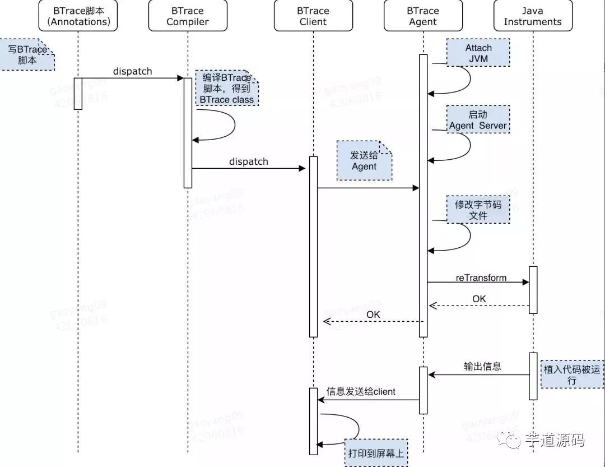

BTrace

[TOC]

# 1 BTrace简介

这是一个动态的操作JVM中字节码的工具，基于Java的Instrumentation接口，ASM框架以及Attach API实现的；可以对JVM中类的行为进行动态监控和操作。[github地址](https://github.com/btraceio/btrace)

# 2 BTrace的整体结构

BTrace通过下面的几个步骤和组件，完成对JVM的监控和连接；

1. Java脚本，使用BTrace提供的注解，我们可以编写出用于监控的逻辑java代码
2. 编译器，把Java脚本编译成class文件
3. 客户端：通过客户端把class文件发送到JVM执行代理的BTrace服务
4. JVM执行代理其实开启了一个BTrace服务，接受来自客户端的class文件，根据规则匹配出需要转换的类，通过ASM，Instrumentation等接口修改字节码。

整体执行流程图如下：

出于安全性的限制，BTrace在使用的时候，有以下的限制条件：

- 不能创建对象，数组
- 不能捕获或者抛出异常
- 不能随便的调用其他类或对象的方法，只能通过特定的API调用一些方法
- 不能添加成员变量和成员方法，只能添加static public void的方法
- 不能添加内部类，嵌套类
- 不能有同步方法和同步代码块
- 不能使用循环
- 不能随便继承某个类(java.lang.Object除外)，不能实现接口
- 不能使用assert，不能使用Class对象