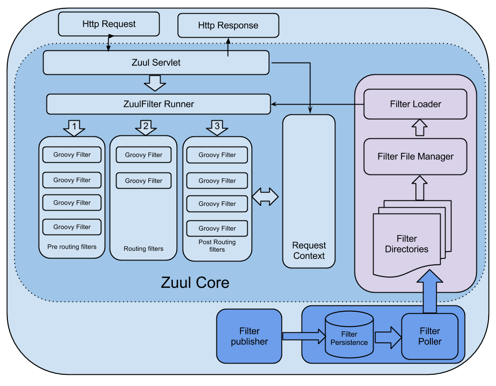

Zuul源码解析

[TOC]

# 1 Zuul介绍

> Zuul是Spring Cloud全家桶中的微服务API网关。
>
> 所有从设备或网站来的请求都会经过Zuul到达后端的Netflix应用程序。作为一个边界性质的应用程序，Zuul提供了动态路由、监控、弹性负载和安全功能。Zuul底层利用各种filter实现如下功能：
>
> - 认证和安全 识别每个需要认证的资源，拒绝不符合要求的请求。
> - 性能监测 在服务边界追踪并统计数据，提供精确的生产视图。
> - 动态路由 根据需要将请求动态路由到后端集群。
> - 压力测试 逐渐增加对集群的流量以了解其性能。
> - 负载卸载 预先为每种类型的请求分配容量，当请求超过容量时自动丢弃。
> - 静态资源处理 直接在边界返回某些响应。

## 1.1 观其大略，不求甚解

